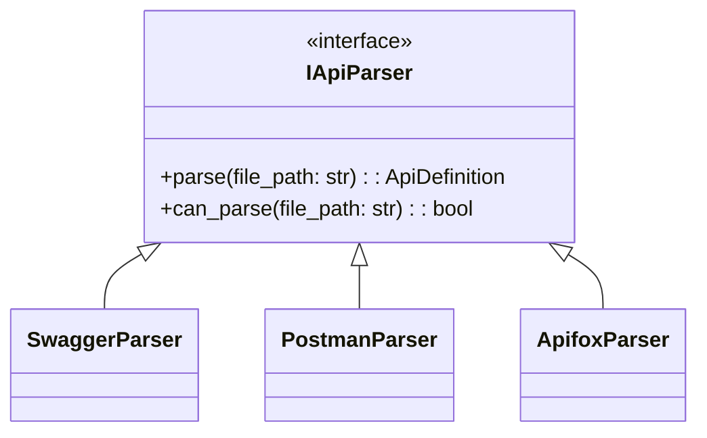

# API Test Case Generator

Automatically generate test cases from API specifications (Swagger/OpenAPI, Postman coming soon).

## Features

- Generate normal flow test cases
- Generate error flow test cases  
- Generate boundary value test cases
- Generate security test cases (OWASP Top 10)
- Output JSON and HTML reports
- Extensible architecture for multiple API formats

## Architecture

The tool now uses a plugin-style architecture:



Key components:
- `IApiParser`: Base interface for all parsers
- `ApiDefinition`: Unified output format
- `TestCaseGenerator`: Generates tests from ApiDefinition

## Installation (Original - May Not Work)

```bash
pip install -e .
```

## Standalone Usage (Recommended)

Run the tool with any Swagger/OpenAPI file:

```bash
python3 standalone_runner.py path/to/api_spec.yaml
```

Example with included sample file:

```bash
python3 standalone_runner.py examples/petstore.yaml
```

Expected output:
```
Generated 8 test cases
JSON report saved to: output/test_cases.json  
HTML report saved to: output/report.html
```

To view the HTML report:
```bash
open output/report.html
```

Verification:
1. The tool should generate test cases for all endpoints
2. Reports should be created in the output directory
3. HTML report should display all test cases in a readable format

Requirements:
- Python 3.x
- PyYAML (`pip install pyyaml`)
- Jinja2 (`pip install jinja2`)

## Roadmap

- [x] Swagger/OpenAPI support
- [ ] Postman collection support
- [ ] Apifox format support
- [ ] More test generation strategies

## Development

Run tests:
```bash
pytest
```

Contribute new parsers by implementing the `IApiParser` interface.
